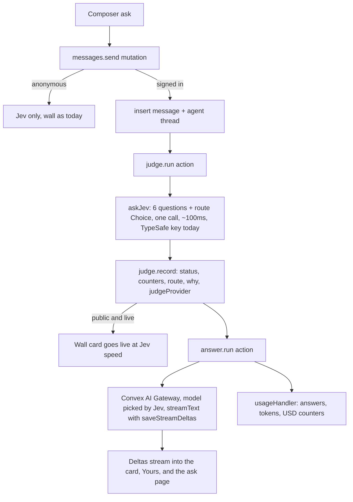

# Ask Jev anything: gateway answers, accounts, profiles

## What is true today (research findings)

- Jev is a judgment model. TypeSafe System One returns typed answers only (Choice, Score, Noul). It has no text generation, so a "ChatGPT style" sentence must come from a language model. Jev stays the judge and becomes the router.
- Convex AI Gateway (`getServiceToken("ai-gateway")`, `convex` 1.45+, this repo is on 1.46) exposes OpenAI and Anthropic compatible endpoints and works from the default runtime with `@convex-dev/ai-sdk-provider` (`convexGateway("provider/model")`). Needs a paid Convex plan. Billing per token at OpenRouter rates. `typesafe-ai/jev` is not on the Convex model list yet, so we ship a switch.
- Auth v2 alpha (`@convex-dev/auth@2.0.0-alpha.2`) is wired with username + password for one admin. Argon2id, rate limiting, `changePassword` exist. No user deletion API in the alpha; deletion is a cascade on our side.
- The admin account already exists on dev (one `users` row with only `username`), prod is being created per `prds/sec-check.md`. `users.createUser` currently refuses sign up unless `ADMIN_SIGNUP_OPEN=1` and no row exists. `requireAdmin` reads `ADMIN_USERNAME` on every call. `admin.me` returns `{ admin, signupOpen }`, `useIsAdmin` drives Hide / Unhide on wall cards, `/admin` has its own sign in form.
- `@convex-dev/agent` is the Convex recommended component for LLM replies: per user threads, streaming deltas via normal queries, `deleteAllForUserId`, `usageHandler` for cost. Accepts `convexGateway` as its model.

## Architecture

## Decisions

- Anonymous visitors: unchanged. Wall rules stay 3 to 15 safe words, Jev only. An open question on the wall gets a "Sign in for a full answer" hint on the card.
- Signed in users: every ask gets a short model answer (one to three sentences). For yes, no, or depends the model explains Jev's verdict in one line. For open questions it answers. Jev's `reply` chip and answers toggle stay as they are.
- Public asks keep the 3 to 15 safe word rule. Private asks relax to blocklist plus held terms, up to 60 words. Jev's safety probes still run on every ask; a held private ask gets no model answer.
- Model routing is a seventh Jev Choice in the same call, zero added latency. Four routes on the Convex model list: `quick` (gemini 3.5 flash lite), `explain` (claude haiku 4.5), `reason` (gpt 5.4 mini), `current` (perplexity sonar). The one line why is the route description in code, shown with model name and Jev confidence.
- Jev keeps working today on `TYPESAFE_API_KEY`. Nothing here depends on Jev being in the gateway. Only model answers go through the gateway.
- Jev provider switch: `convex/lib/jev.ts` wraps the call. `JEV_PROVIDER` unset or `typesafe` posts to TypeSafe exactly as `lib/typesafe.ts` does now. `JEV_PROVIDER=gateway` mints `getServiceToken("ai-gateway")` and sends the same System One body with `model: "typesafe-ai/jev"` to `JEV_GATEWAY_URL`. On `AiGatewayDisabled`, `AiGatewayUnavailable`, or unknown model, and a TypeSafe key present, it falls back to TypeSafe and logs once. Assumption flagged: Convex has not published the Jev gateway path or body shape, so the gateway branch is written against the System One shape and verified when Jev lands.
- Switch kit for later: a `task.md` to do plus a paste ready prompt in the PRD section "Switch Jev to the Convex AI Gateway": check the models page for `typesafe-ai/jev`, confirm the endpoint, `npx convex env set JEV_PROVIDER gateway` and `JEV_GATEWAY_URL` on dev, post three asks, compare `reply`, latency, tokens, then repeat on prod. `stats.gate` and the hero line show "Jev online · TypeSafe" or "Jev online · Convex AI Gateway"; the How it works Judge fact says the same, so the flip is visible with no redeploy.
- Admin is a normal account plus a role. The existing admin account keeps its current email and password; nothing is recreated. When the signed in email matches `ADMIN_USERNAME` the session unlocks everything already shipped: `/admin` dashboard (counts, All / Live / Held / Hidden, search, Hide / Unhide), the Hide / Unhide button on wall cards, the `Admin` link. The admin also gets every new user feature. New admin powers: hide or unhide a public ask's model answer, and see `userId`, `handle`, `visibility`, `route`, `answerModel` in admin row meta. Every admin function keeps `requireAdmin`.
- Do not break the existing admin row. Every new user field is `v.optional` so the current row validates untouched. Reads use defaults (`publicProfile` false). A one time `backfillUsers` gives the admin `userNumber` 1 and a handle from the email local part. `requireUser`, `admin.me`, `useIsAdmin`, `admin.list`, `admin.search`, `admin.setHidden`, and the wall card buttons stay as they are and only gain fields. Auth keys off the username component, so sign in is unaffected either way.
- Sign up gate from `prds/sec-check.md` carried over: public sign up opens, so the "refuse once any row exists" guard is removed, but first claim protection stays. `createUser` refuses the `ADMIN_USERNAME` email unless `ADMIN_SIGNUP_OPEN=1`. Once the admin row exists the username component refuses duplicates, so nobody can take that email. `/admin` keeps its sign in form so the current flow still works; its "Create the admin account" toggle becomes a link to `/sign-up`.
- Rate limits lift on sign in. Today `lib/rateLimits.ts` allows 5 posts per minute per IP and a token bucket of 5 per minute with capacity 3 per anonymous session. Anonymous stays exactly that. A signed in user is keyed by `userId` instead of session and IP: `userPost` token bucket 20 per minute with capacity 10, no IP window (the account is the identity, and the IP limit would punish shared networks). Model answers keep their own budget: `answer` 10 per minute, `answerDaily` 200 per day per user. The Composer rule note says "Signed in: 20 asks a minute" so the lift is visible. Every limit lives in one table in `rateLimits.ts` so the numbers are one edit.
- Admin sees accounts and usage. New `/admin` tab `Users` lists every signed in account with email, handle, user number, joined date, status, last ask, and usage: asks (public, private), answers, input tokens, output tokens, model spend, Jev tokens. Totals row at the top. Search by email or handle. Per user counters live in a `userUsage` table (one row per user, high churn kept off the `users` doc per Convex guidance) bumped in `judge.record` and the agent `usageHandler` in the same transaction as the message writes.
- Admin can pause, block, and restore accounts. `users.status` is `active | paused | blocked` (optional, missing means active). Paused: can sign in, sees a banner, cannot post, get answers, or follow up; history and export still work. Blocked: `requireUser` throws, sign in succeeds at the auth layer but the app treats the session as signed out and shows "This account is blocked", every public ask by that user is hidden from the wall, and the email lands in a `blockedEmails` table so it cannot sign up again after deletion. Unpause and unblock reverse both. The admin cannot pause or block itself. All of it behind `requireAdmin`, with a reason field and `moderatedAt` stored on the user for the audit trail. Assumption flagged: the auth alpha has no session revoke API I could find, so block is enforced at `requireUser` on every call rather than by killing the session; the effect is the same for the user.
- Account deletion in the alpha: delete the `users` row, `components.authUsername.public.deleteUsername`, delete agent threads and messages, delete private asks, detach public asks (clear `userId`, keep them so the count stays honest), delete the photo, sign out. Password hash stays orphaned in the password component; documented limitation. The admin account cannot delete itself from the UI (guard in `deleteAccount`).
- Routing: small `useRoute` hook (pathname + `pushState`), no dependency. Static hosting already serves `index.html` for every path.
- Tooltips: `@radix-ui/react-tooltip`, styled with existing tokens for both themes.

## Backend changes

### Schema `convex/schema.ts`

- `users`: keep `username`. Add, all optional: `handle` (index `by_handle`), `displayName`, `bio`, `github`, `linkedin`, `x`, `photoId: v.id("_storage")`, `publicProfile`, `userNumber` (index `by_userNumber`), `status` (`active | paused | blocked`, index `by_status`), `statusReason`, `moderatedAt`. `isAdmin` derived at read time from `ADMIN_USERNAME`.
- `sequences`: `{ key, value }`, index `by_key`, for "User number 10".
- `userUsage`: `{ userId, asks, publicAsks, privateAsks, answers, answerInputTokens, answerOutputTokens, answerMicroUsd, jevInputTokens, jevOutputTokens, lastAskAt }`, index `by_userId`. One row per user, created on first ask.
- `blockedEmails`: `{ email, reason, blockedAt }`, index `by_email`. Checked in `createUser`.
- `messages`: add `userId?`, `visibility` (`public | private`, legacy rows backfilled to `public`), `threadId?`, `route`, `routeConfidence`, `judgeProvider`, `answerModel`, `answerStatus` (`pending | streaming | done | failed | skipped`), `answerText`, `answerHidden?`, `answerInputTokens`, `answerOutputTokens`, `answerLatencyMs`, `archived?`. Indexes `by_visibility_and_status` (wall moves here), `by_user`, `by_user_and_archived`.

### Auth `convex/users.ts`, `convex/auth.ts`, `convex/lib/auth.ts`

- Open sign up: `createUser` inserts a row, allocates `userNumber`, derives a handle with numeric suffix on collision. `ADMIN_USERNAME` still needs `ADMIN_SIGNUP_OPEN=1`. `requireAdmin` unchanged. `admin.me` keeps `admin` and `signupOpen`.
- Export `changePassword`. New `requireUser(ctx)` returns the user doc or throws `ConvexError("Not signed in")`, and throws `ConvexError("Account blocked")` when `status` is `blocked`. `requireActiveUser(ctx)` adds `ConvexError("Account paused")` and gates `send`, `followUp`, and profile edits; reads like `me`, `history`, `exportData` use `requireUser` so a paused user can still see and export their data. No user ids accepted as arguments for authorization.
- `createUser` refuses an email present in `blockedEmails`.

### Judge `convex/questions.ts`, `convex/judge.ts`, `convex/lib/jev.ts`

- Add `route` Choice with four criteria plus `WHY` copy. `judge.record` stores route fields and `judgeProvider`, then schedules `internal.answer.run` when the message has a `userId` and is not blocked.
- `lib/jev.ts` provider switch with TypeSafe fallback. `askJev()` returns `{ answers, usage, provider, latencyMs }`.
- `stats.gate` returns `{ jev, provider }` read from env, no redeploy to flip.

### Answers `convex/answer.ts`, `convex/convex.config.ts`, `convex/lib/pricing.ts`

- Mount `@convex-dev/agent`. One `Agent` with `convexGateway(ROUTES.quick.model)` default and per call model override. Instructions: one to three short sentences, plain text, use the verdict when given.
- `answer.run` internal action: `agent.streamText(ctx, { threadId }, { prompt }, { saveStreamDeltas: true })`, then patch `answerText`, status, tokens, latency. One retry, then `failed` with Retry in Yours.
- `usageHandler` bumps sharded counters `answers`, `answerInputTokens`, `answerOutputTokens`, `answerMicroUsd` from a per model price table.
- `answer.followUp` (owner only, rate limited) and `answer.listMessages` with `syncStreams` (owner or public thread).
- Rate limits in `lib/rateLimits.ts`: existing `ip` and `post` untouched for anonymous. New `userPost` token bucket 20 per minute capacity 10 keyed by `userId`, `answer` 10 per minute, `answerDaily` 200 per day. `send` picks the anonymous or signed in set based on `requireUser` succeeding. Docs remind to set a spend limit on the Convex billing page.
- `usageHandler` also bumps the caller's `userUsage` row (answers, tokens, micro USD). `judge.record` bumps `asks`, `publicAsks` or `privateAsks`, Jev tokens, `lastAskAt` when the message has a `userId`.

### Admin `convex/admin.ts`

- `adminMessage` gains `userId`, `handle`, `email`, `visibility`, `route`, `answerModel`, `answerHidden`. New `setAnswerHidden` (admin only). `list` and `search` stay admin only and now include private asks since moderation needs every row.
- `admin.users` query: paginated join of `users` and `userUsage`, filter `all | active | paused | blocked`, search by email or handle prefix, plus a `totals` object (accounts, asks, answers, tokens, spend). `admin.setUserStatus` mutation: `{ userId, status, reason? }`, refuses the admin's own row, writes `status`, `statusReason`, `moderatedAt`; on `blocked` inserts into `blockedEmails` and sets `hidden: true` on that user's public asks; on `active` from blocked removes the `blockedEmails` row and unhides asks that were hidden by the block (tracked with `hiddenByBlock: true` on the message so admin manual hides are not undone). `admin.userDetail` query: one user, their usage row, and their last 20 asks for the drawer. All behind `requireAdmin`.

### Messages and profiles `convex/messages.ts`, `convex/profile.ts`

- `send` gains optional `visibility`; signed in path uses `requireUser`, `parsePrivateAsk` in `lib/words.ts` for private, creates the thread, stores `userId`. Anonymous path unchanged.
- `wall` and `search` read `visibility: "public"` only. `toPublic` adds `answerText` (masked when `answerHidden`), `answerModel`, `route`, author handle and photo URL when the profile is public.
- `profile.ts`: `me`, `update` (handle `^[a-z0-9_]{3,20}$`, bio 160, links limited to github.com, linkedin.com, x.com), `generateUploadUrl`, `setPhoto` (image type, 2 MB, deletes old), `byHandle` (public fields, null when private), `history` (paginated, filter all / public / private / archived), `setVisibility`, `setArchived`, `remove`, `exportData` (JSON), `deleteAccount` (cascade above).

### Migrations `convex/migrations.ts`

- `backfillVisibility`: batched, sets `visibility: "public"` on legacy rows.
- `backfillUsers`: for rows missing `userNumber`, assign next number in `_creationTime` order, handle from the email, `publicProfile: false`. Admin becomes user number 1. Run on dev, then prod right after deploy.

## Frontend changes

- `src/lib/router.ts`: `useRoute`, `Link`, `navigate`. Routes `/`, `/sign-in`, `/sign-up`, `/me`, `/u/:handle`, `/a/:id`, `/admin`, `/.well-known/change-password` redirects to `/me`.
- `Composer.tsx`: auto growing textarea in the same pill (Enter submits, Shift+Enter newline). Signed in: segmented `Wall | Private` with tooltips, rule note switches with mode and mentions the lifted limit ("20 asks a minute signed in"); disabled with the paused note when the account is paused. Anonymous: "Sign in for full answers" link. Bold guide copy: "Open questions get a short answer from the model Jev picks."
- `Wall.tsx` / `WallCard`: answer text under the ask, streaming via `useSmoothText`, mono line "Answered by claude haiku 4.5 · Jev picked it: wants an explanation · 92%". Author avatar and handle link when public. Admin sees Hide / Unhide (unchanged) plus Hide answer when present.
- `Yours.tsx`: for signed in users reads `profile.history` (latest three) with answer status, Retry, link to the ask page. Anonymous path unchanged.
- New pages: `SignIn.tsx` (sign in and sign up, reuses Admin form styles, shows the `ADMIN_SIGNUP_OPEN` hint when the admin email is typed and the flag is off), `Me.tsx` (profile form, photo upload, public toggle, change password, history with filter, archive, delete, export, delete account with typed confirmation), `Profile.tsx` (`/u/:handle`: photo, name, "User number 10", joined date, links, public asks), `AskPage.tsx` (`/a/:id`: ask, Jev answers, streaming thread, follow up box for the owner).
- `Admin.tsx`: keeps its sign in form and "Not authorized" state exactly as today. "Create the admin account" becomes a link to `/sign-up`. Gets a `Messages | Users` segmented tab (reuses `.seg`); Messages is the current dashboard with rows showing new meta (email, handle, visibility, route, model) and a "Hide answer / Show answer" button next to Hide / Unhide.
- `AdminUsers.tsx` (new, rendered by the Users tab): totals strip (accounts, asks, answers, tokens in and out, model spend, Jev spend) with tooltips; status filter `All | Active | Paused | Blocked`; search box; table rows with avatar, email, handle, user number, joined, last ask, asks, answers, tokens, spend, status pill; `Pause`, `Block`, `Restore` buttons with a one line reason prompt and confirm; clicking a row opens a detail drawer with the usage row and last 20 asks. Reuses the existing admin table and mono styles for both themes.
- Paused or blocked states on the client: `App.tsx` reads `status` from `profile.me`; paused shows a top banner "Your account is paused. You can read and export your history but not post." and disables the Composer; blocked shows the signed out UI plus a "This account is blocked" note on `/sign-in`.
- `App.tsx`: hero top row gets `Sign in` or the avatar menu (`Me`, `Sign out`, `Admin` for the admin). Count panel stays in the right column.
- `CostTracker.tsx`: rows `Model spend` and `Answers`; `stats.cost` returns the counters. Tooltips on every row.
- `HowItWorks.tsx`: bold "What is new" paragraph; facts add `Answers`, `Gateway`, `Accounts`; Judge fact shows the live Jev provider.
- `Tooltip.tsx` on Radix; applied to counter, cost rows, chips, mood dot, latency, model line, visibility toggle, archive and export buttons, user number.
- `styles.css`: textarea pill, segmented toggle reuses `.seg`, answer block, avatar, profile grid, history list, tooltip; all on existing tokens for both themes.

## Env and setup

- `npm i @convex-dev/agent @convex-dev/ai-sdk-provider ai @radix-ui/react-tooltip`
- No gateway key. Paid Convex plan for model answers. `TYPESAFE_API_KEY`, `ADMIN_USERNAME`, `ADMIN_SIGNUP_OPEN` (admin email only now), auth keys unchanged.
- Optional, later: `JEV_PROVIDER=gateway`, `JEV_GATEWAY_URL`. Leave unset now.

## Docs

- New PRD `prds/ask-anything-accounts.md` with the decisions, an "Existing admin compatibility" section, the "Switch Jev to the Convex AI Gateway" prompt and env commands, and a completion log. Update `files.md`, `changelog.md`, `README.md` (Agent, AI Gateway rows; features; env), `task.md` (to do: flip Jev to the gateway; run both backfills on prod after deploy).
- After the build, follow `.agents/skills/update-project-docs`: `git log --date=short -n 10` and `git diff --stat` for real dates, move finished items in `task.md` to completed with UTC timestamps, changelog entry under Unreleased, `files.md` for every new file, then print the commit message as plain text.

## Verification

- `npm run typecheck`, `npx convex dev --once`, prettier.
- Admin first, before UI work: push the schema to dev and confirm the existing admin row validates, sign in with the existing admin credentials on `/admin` and `/sign-in`, run `backfillUsers` and confirm `npx convex data users` shows user number 1, confirm `Admin` link, dashboard filters, search, Hide / Unhide, Hide answer, both wall card buttons, and that a private ask shows in the admin list but never on the wall. Second account sees "Not authorized" and no admin buttons. Sign up with the admin email is refused.
- Users tab and moderation: the Users tab lists both accounts with emails and usage that moves after an ask and an answer; pause the second account and confirm it sees the banner, cannot post, can still export; block it and confirm its public asks vanish from the wall, `requireUser` calls fail, and sign up with that email is refused after deletion; restore and confirm the asks return and posting works; the admin row shows no Pause or Block buttons.
- Rate limits: anonymous fourth post in quick succession is limited as today; signed in user posts 10 in a row before the limit trips; sixth answer in a minute is rate limited.
- Browser, light and dark, 1280 and 375: anonymous wall post unchanged; sign up, profile edit, photo upload; public ask goes live at Jev speed then the answer streams in; private ask never on wall or search; open question shows route, model, why; follow up in a thread; archive, unarchive, delete, export; delete account then sign in fails; sixth answer in a minute is rate limited; hero line shows "Jev online · TypeSafe".
- Prod order: `npm run deploy`, run both backfills with `--prod`, confirm the admin can still sign in and hide a card. The `HELD_TERMS` and `overrideReply` items in `task.md` ride along with the same deploy.
