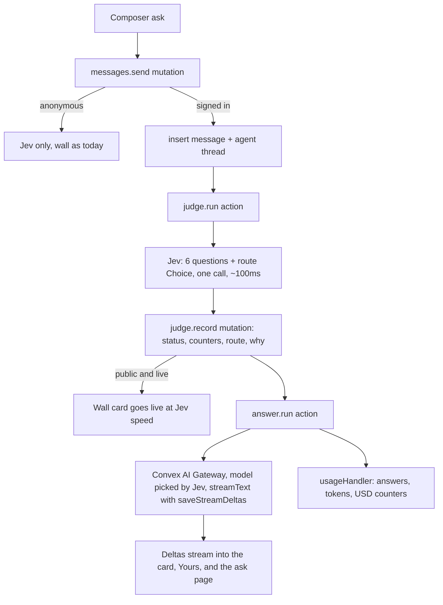

# Ask Jev anything: gateway answers, accounts, profiles

## What is true today (research findings)

- Jev is a judgment model. TypeSafe System One returns typed answers only (Choice, Score, Noul). It has no text generation, so a "ChatGPT style" sentence must come from a language model. Jev stays the judge and the router.
- Convex AI Gateway (`getServiceToken("ai-gateway")`, `convex` 1.45+, this repo is on 1.46) exposes OpenAI and Anthropic compatible endpoints and works from the default runtime with `@convex-dev/ai-sdk-provider` (`convexGateway("provider/model")`). It needs a paid Convex plan. Billing is per token at OpenRouter rates, visible on the team usage page per function. `typesafe-ai/jev` is not on the Convex model list yet; per your note we design for it and ship with a switch.
- Auth v2 alpha (`@convex-dev/auth@2.0.0-alpha.2`) is already wired with username + password for one admin. It ships Argon2id hashing, rate limiting, password rules, `changePassword`. There is no user deletion API in the alpha; deletion is done on our side (see below).
- `@convex-dev/agent` is the Convex recommended component for LLM replies in durable conversations: per user threads, streaming deltas via normal queries, archive status, `deleteAllForUserId`, and a `usageHandler` for cost tracking. It accepts `convexGateway` as its model.

## Architecture

## Decisions (made so the plan is buildable)

- Anonymous visitors: unchanged. Wall rules stay 3 to 15 safe words, Jev only. An open question on the wall gets a "Sign in for a full answer" hint on the card.
- Signed in users: every ask gets a short model answer (one to three sentences). For yes, no, or depends the model explains Jev's verdict in one line. For open questions it answers the question. Jev's `reply` chip and answers toggle stay exactly as they are.
- Public wall asks keep the 3 to 15 safe word rule. Private asks relax to the blocklist plus held terms and up to 60 words, because "ask anything" cannot work through a 12k word allowlist. Jev's safety probes still run on every ask; a held private ask gets no model answer.
- Model routing is a seventh Jev Choice question in the same call, so it adds no latency. Four routes, all on the Convex gateway model list: `quick` (gemini 3.5 flash lite: short facts), `explain` (claude haiku 4.5: prose, advice, comparisons), `reason` (gpt 5.4 mini: math, logic, code), `current` (perplexity sonar: recent events). The "one line why" is the route's description in code, shown with the model name and Jev's confidence. No extra call.
- Jev keeps working today on the existing `TYPESAFE_API_KEY`. Nothing in this plan depends on Jev being in the Convex AI Gateway. Only the model answers go through the gateway.
- Jev provider switch: `convex/lib/jev.ts` wraps the call. `JEV_PROVIDER=typesafe` (default, unset means this) posts to TypeSafe with `TYPESAFE_API_KEY` exactly as `lib/typesafe.ts` does now. `JEV_PROVIDER=gateway` mints `getServiceToken("ai-gateway")` and sends the same System One body with `model: "typesafe-ai/jev"` to `JEV_GATEWAY_URL`. If the gateway call fails with `AiGatewayDisabled`, `AiGatewayUnavailable`, or an unknown model error and a TypeSafe key is set, it falls back to TypeSafe and logs once, so a bad flip never takes the wall down. Assumption flagged: the gateway path and body shape for Jev are not published by Convex yet, so the gateway branch is written against the System One shape and verified when Jev lands.
- Switch kit for later: a `task.md` to do item plus a ready to paste prompt in the PRD (`prds/ask-anything-accounts.md`, section "Switch Jev to the Convex AI Gateway") that says: check the Convex models page for `typesafe-ai/jev`, confirm the endpoint path, set `JEV_PROVIDER=gateway` and `JEV_GATEWAY_URL` on dev with `npx convex env set`, post three asks and compare `reply`, latency, and tokens against the TypeSafe path, then set the same on prod. `stats.gate` and the hero line report which provider is live ("Jev online · TypeSafe" or "Jev online · Convex AI Gateway") and the How it works Judge fact card says the same, so the switch is visible in the UI without a redeploy.
- Account deletion in the auth alpha: delete the `users` row, call `components.authUsername.public.deleteUsername`, delete all agent threads and messages, delete private asks, detach public wall asks (clear `userId`, keep them so the count stays honest), delete the photo, sign out. The password hash stays orphaned inside the password component (no alpha API). Documented as a known limitation.
- Admin is a normal account plus a role. The one sign in form at `/sign-in` serves everyone. When the signed in email matches `ADMIN_USERNAME` the session unlocks every admin feature already shipped: the `/admin` dashboard (counts, All / Live / Held / Hidden filter, search every row, Hide / Unhide), the Hide / Unhide button on each wall card, and the `Admin` link in the top row. The admin also gets the new user features (profile, private asks, history, answers) because they are a user too. New admin powers on top: hide or unhide a public ask's model answer, and see `userId`, `handle`, `visibility`, `route`, and `answerModel` in the admin row meta. Every admin function keeps `requireAdmin`, which checks both a valid session and the env var. The old "Create the admin account" form on `/admin` goes away; the admin signs up like anyone else and the env var grants the role.
- Routing on the client: a small `useRoute` hook (pathname + `pushState`), no router dependency. Static hosting already serves `index.html` for every path.
- Tooltips: `@radix-ui/react-tooltip` (accessible, unstyled, small). Styled with the existing tokens for both themes.

## Backend changes

### Schema `convex/schema.ts`

- `users`: keep `username` (email). Add `handle` (unique slug, index `by_handle`), `displayName`, `bio`, `github`, `linkedin`, `x` (optional strings, validated URLs), `photoId: v.optional(v.id("_storage"))`, `publicProfile: v.boolean()`, `userNumber: v.number()` (index `by_userNumber`), `isAdmin` derived at read time from `ADMIN_USERNAME` (unchanged).
- `sequences`: `{ key: v.string(), value: v.number() }`, index `by_key`. Gives "user number 10". Mutations are serializable so a single doc is safe at sign up volume.
- `messages`: add `userId: v.optional(v.id("users"))`, `visibility: v.union("public","private")` (backfill legacy rows to `public`), `threadId: v.optional(v.string())`, `route`, `routeConfidence`, `answerModel`, `answerStatus` (`pending | streaming | done | failed | skipped`), `answerText` (final copy for the wall card and export), `answerInputTokens`, `answerOutputTokens`, `answerLatencyMs`, `archived: v.optional(v.boolean())`. New indexes: `by_visibility_and_status` (wall query moves here), `by_user` , `by_user_and_archived`.

### Auth `convex/users.ts`, `convex/auth.ts`, `convex/lib/auth.ts`

- Open sign up: `createUser` inserts a row, allocates `userNumber`, derives a starter `handle` from the email local part with a numeric suffix on collision. Admin stays whoever matches `ADMIN_USERNAME`; `requireAdmin` unchanged. `admin.me` keeps returning `admin: true | false` so `useIsAdmin` and the wall card buttons work as they do now.
- `convex/admin.ts`: `adminMessage` gains `userId`, `handle`, `visibility`, `route`, `answerModel`, `answerHidden`. New `setAnswerHidden` mutation (admin only) masks a public ask's model answer on the wall the same way `hidden` masks the text. `list` and `search` stay admin only and now cover private asks too, since moderation needs to see every row.
- Export `changePassword` from `setupUsernamePassword`. New `requireUser(ctx)` helper returning the user doc or throwing `ConvexError("Not signed in")`. Every user facing function uses it; no user ids accepted as arguments for authorization.

### Judge `convex/questions.ts`, `convex/judge.ts`, `convex/lib/jev.ts`

- Add `route` Choice with the four criteria plus `WHY` copy per route. `judge.record` stores route fields, then schedules `internal.answer.run` when the message has a `userId` and is not blocked.
- `lib/jev.ts` provider switch as above with the TypeSafe fallback. `lib/typesafe.ts` types reused. `askJev()` returns `{ answers, usage, provider, latencyMs }` so `judge.record` can store `judgeProvider` on the message and the card meta can show it.
- `stats.gate` returns `{ jev: boolean, provider: "typesafe" | "gateway" }` read from the env vars, no redeploy needed to flip.

### Answers `convex/answer.ts`, `convex/convex.config.ts`, `convex/lib/pricing.ts`

- Mount `@convex-dev/agent`. One `Agent` with `convexGateway(ROUTES.quick.model)` as default and per call `model` override to the routed model. Instructions: answer in one to three short sentences, plain text, use the verdict when given.
- `answer.run` internal action: rate limit check already done in `send`; `agent.streamText(ctx, { threadId }, { prompt }, { saveStreamDeltas: true })`, then patch `answerText`, `answerStatus`, tokens, latency. Retries once, then `failed` with a Retry button in Yours.
- `usageHandler` bumps sharded counters `answers`, `answerInputTokens`, `answerOutputTokens`, `answerMicroUsd` (integer micro dollars from a per model price table in `pricing.ts`).
- Follow ups: `answer.followUp` mutation (owner only, same rate limit) saves the prompt and schedules a stream in the same thread. `answer.listMessages` query with `syncStreams` for the ask page, owner or public thread only.
- Rate limits `lib/rateLimits.ts`: `answer` token bucket 10 per minute per user, `answerDaily` fixed window 200 per day per user. Reminder in docs to set a spending limit on the Convex team billing page.

### Messages and profiles `convex/messages.ts`, `convex/profile.ts`

- `send` gains optional `visibility`; signed in path uses `requireUser`, relaxed parser for private (`parsePrivateAsk` in `lib/words.ts`: blocklist, held terms, 3 to 60 words), creates the agent thread, stores `userId`. Anonymous path unchanged.
- `wall` and `search` read only `visibility: "public"`. `toPublic` adds `answerText`, `answerModel`, `route`, author handle and photo URL when the author's profile is public.
- `profile.ts`: `me` (own profile), `update` (handle regex `^[a-z0-9_]{3,20}$`, bio 160 chars, links limited to github.com, linkedin.com, x.com hosts), `generateUploadUrl`, `setPhoto` (checks `_storage` metadata: image type, 2 MB cap, deletes the old file), `byHandle` (public fields only, null when private), `history` (paginated own asks, filter all, public, private, archived), `setVisibility`, `setArchived`, `remove` (owner; deletes thread and row; decrements nothing since private rows are not in `live`), `exportData` (own asks plus thread messages as JSON), `deleteAccount` (cascade above).

### Migration `convex/migrations.ts`

- Internal batched mutation setting `visibility: "public"` on legacy rows, run once with `npx convex run` on dev then prod.

## Frontend changes

- `src/lib/router.ts` `useRoute`, `Link`, `navigate`. Routes: `/`, `/sign-in`, `/sign-up`, `/me` (settings + history), `/u/:handle`, `/a/:id` (ask page with the thread and follow ups), `/admin`, `/.well-known/change-password` redirects to `/me`.
- `Composer.tsx`: input becomes an auto growing textarea inside the same pill (Enter submits, Shift+Enter newline), larger by default. Signed in: segmented `Wall | Private` control with tooltips, live rule note switches with the mode. Anonymous: "Sign in for full answers" link. Guide copy updated in bold: "Open questions get a short answer from the model Jev picks."
- `Wall.tsx` and `WallCard`: answer text under the ask (`.wallcard__answer`), streaming via `useSmoothText`, then a mono line "Answered by claude haiku 4.5 · Jev picked it: wants an explanation · 92%". Author avatar and handle link when the profile is public. Anonymous open ask shows the sign in hint. Chip and answers toggle unchanged.
- `Yours.tsx`: shows for signed in users from `profile.history` (latest three), including answer status, Retry, and a link to the ask page.
- New pages: `SignIn.tsx` (reuse the Admin form styles, sign in and sign up, Auth v2 error copy), `Me.tsx` (profile form, photo upload with preview, public or private profile toggle, change password, history with filter and search, archive, unarchive, delete, export JSON, delete account with typed confirmation), `Profile.tsx` (`/u/:handle`: photo, name, "User number 10", joined date, links, public asks), `AskPage.tsx` (`/a/:id`: the ask, Jev's answers, the thread with streaming, follow up box for the owner).
- `App.tsx`: hero top row gets `Sign in` or the avatar menu (`Me`, `Sign out`, `Admin` for the admin). Count panel stays in the right column.
- `Admin.tsx`: drops its own sign in form and sends a signed out visitor to `/sign-in?next=/admin`. A signed in non admin still sees "Not authorized". The dashboard rows show the new meta (handle, visibility, route, model) and gain a "Hide answer / Show answer" button next to Hide / Unhide. Wall cards for the admin get the same second button when an answer is present.
- `CostTracker.tsx`: add rows `Model spend` and `Answers`; `stats.cost` returns the new counters. Tooltips on every row.
- `HowItWorks.tsx`: bold "What is new" paragraph, facts add `Answers` (model picked by Jev), `Gateway` (link to the Convex AI Gateway docs), `Accounts` (Convex Auth).
- `Tooltip.tsx` wrapper on Radix; applied to counter, cost rows, chips, mood dot, latency, model line, visibility toggle, archive and export buttons, user number.
- `styles.css`: textarea pill, segmented toggle reuse `.seg`, answer block, avatar, profile grid, history list, tooltip, all on existing tokens for both themes.

## Env and setup

- `npm i @convex-dev/agent @convex-dev/ai-sdk-provider ai @radix-ui/react-tooltip`
- No gateway key. Requires the Convex team on a paid plan for the model answers. Existing `TYPESAFE_API_KEY`, `ADMIN_USERNAME`, auth keys unchanged and still drive Jev.
- Optional, for later: `JEV_PROVIDER=gateway` and `JEV_GATEWAY_URL`. Leave both unset now and Jev runs on the TypeSafe key as it does today.

## Docs

- New PRD `prds/ask-anything-accounts.md` with the decisions above, a "Switch Jev to the Convex AI Gateway" section holding the paste ready prompt and the exact `npx convex env set` commands, and a completion log. Update `files.md`, `changelog.md`, `README.md` (stack rows for Agent, AI Gateway; features; env, including the two optional Jev switch vars), `task.md` (to do: "Flip Jev to the Convex AI Gateway when `typesafe-ai/jev` is on the models page", linking to the PRD section).

## Verification

- `npm run typecheck`, `npx convex dev --once`, prettier.
- Browser, light and dark, 1280 and 375: anonymous wall post unchanged; sign up, profile edit, photo upload; public ask goes live at Jev speed then the answer streams in on the wall card and in Yours; private ask never appears on the wall or search; open question picks a route and shows model plus why; follow up in a thread; archive, unarchive, delete, export; delete account then attempt sign in fails; sixth answer in a minute is rate limited.
- Admin: sign in with the `ADMIN_USERNAME` email at `/sign-in`, confirm the `Admin` link appears, `/admin` loads with filters, search, Hide / Unhide and Hide answer working, wall cards show both admin buttons, a private ask appears in the admin list but never on the wall. Sign in with a second account and confirm `/admin` says "Not authorized" and no admin buttons render.
